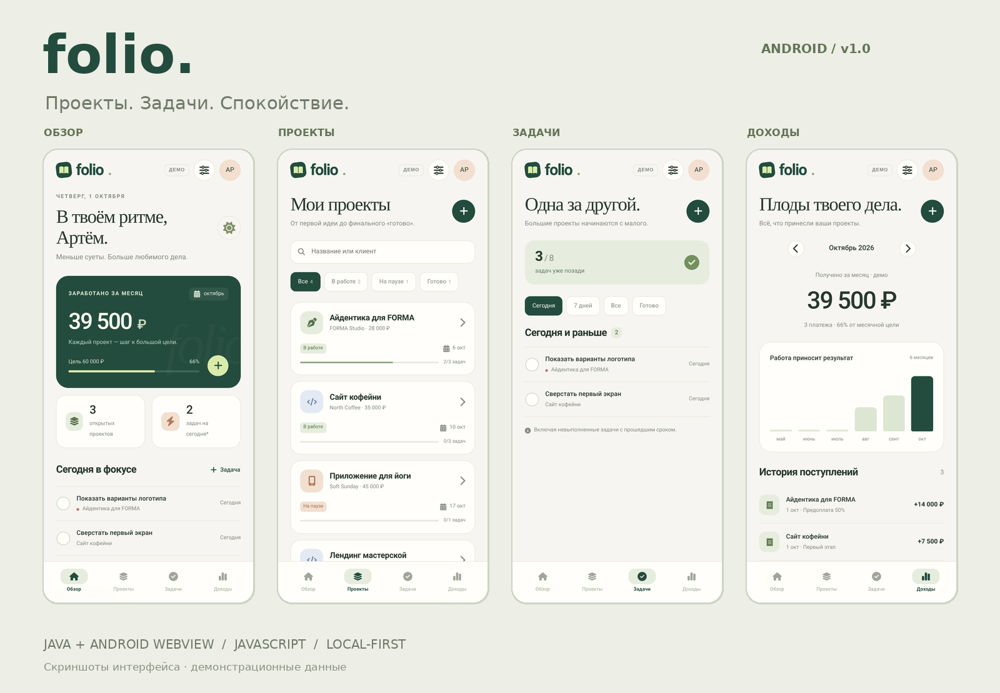

# folio.
### Проекты. Задачи. Спокойствие.

**Folio 1.0.0** — небольшое Android-приложение для фрилансера. Проекты, задачи, дедлайны и поступления находятся в одном рабочем пространстве. Без аккаунта, подписки, банковских интеграций и сервера.



## Запустить сейчас

**Android:** [скачать тестовый APK](dist/Folio-1.0.0.apk?raw=true). Сборка рассчитана на Android 8.0+ с современным Android System WebView. Откройте APK на телефоне и подтвердите обычный диалог установки. Это тестовая сборка для демонстрации, не релиз из магазина. Если Android запрещает установку из браузера, разрешение нужно выдать только этому источнику, а не отключать защиту устройства целиком. Если приложение не устанавливается или закрывается, сохраните точный текст ошибки; запуск на реальном устройстве в данной среде не проверялся.

**Компьютер:** откройте `PREVIEW.html` в современном браузере. Сборка, сервер и npm не нужны. В preview используется настоящая localStorage, а не тестовые данные хранилища. Начальные примеры помечены «ДЕМО» и доступны для редактирования.

Данные Android-приложения и браузерной версии независимы. Для переноса используйте резервную копию.

## Что работает

- Обзор: фактически записанные поступления за месяц, месячная цель, число открытых проектов и задачи на сегодня, включая просроченные.
- Проекты: создание, редактирование, удаление, поиск по названию/клиенту, бюджет, срок, направление, заметки и статус. Детальный экран показывает задачи и поступления.
- Задачи: связь с проектом, срок, приоритет, выполнение, редактирование, удаление и фильтры. Прогресс проекта считается по выполненным задачам, а не рисуется заранее.
- Доходы: создание/редактирование/удаление поступлений, переключение месяца, график последних шести месяцев. Завершение проекта само по себе не создаёт оплату.
- Настройки: имя, месячная цель, светлая/тёмная/системная тема, экспорт/импорт JSON, очистка и повторная загрузка демо.

При удалении проекта связанные задачи удаляются после подтверждения, а реальные поступления остаются в истории с названием бывшего проекта. Все суммы указаны в российских рублях. Расходы, налоги и чистая прибыль не рассчитываются.

## Резервная копия

Настройки → Резервная копия. В Android копируется полный JSON-текст: сохраните его в заметки или текстовый файл. В браузере дополнительно доступно скачивание `.json`. Восстановление: вставить JSON (либо выбрать файл в браузере), пройти проверку и подтвердить замену данных. Копия может содержать имена клиентов и суммы; не публикуйте её в репозитории.

Локальное хранилище не шифруется самим Folio. Данные удалятся при очистке данных приложения или его удалении. Облачного резервирования нет, `allowBackup=false`.

## Технологии

**Android:** Java, Activity, системный Android WebView, Gradle/Android Gradle Plugin. Интерфейс — HTML, CSS и JavaScript, без React/Flutter/Compose. Это гибридное Android-приложение, а не набор нативных Kotlin-экранов.

**Интерфейс:** адаптивный CSS, SVG-иконки Font Awesome Free, системные шрифты. В пакете нет файлов шрифтов и внешних CDN-зависимостей. Пользовательские строки экранируются перед отображением. Импорт проверяет схему и связи записей. APK не запрашивает разрешений Android, в том числе INTERNET; JavaScript-моста к нативным методам нет.

**Веб-версия:** каталог `web/` содержит манифест и service worker для установки как PWA после размещения на HTTPS. PWA-установка и HTTP-кэш в этой среде не проверены. `PREVIEW.html` предназначен для быстрого просмотра, без service worker.

## Структура

```text
web/                     основной интерфейс, данные, PWA
android/                 Java-оболочка и стандартный Gradle-проект
.github/workflows/       сборка APK в GitHub Actions
PREVIEW.html             автономная версия для просмотра
PORTFOLIO.md             описание кейса и сценарий демонстрации
LICENSE                  лицензия собственного кода
THIRD_PARTY.md           лицензии и источники сторонних иконок
docs/screenshots/        снимки работающего интерфейса, обложка
 docs/test-report.json   отчёт 50 UI/логических проверок
 docs/apk-verification.json 36 структурных/криптографических проверок
dist/                    тестовый APK
tools/                   упаковка, проверки, генерация preview
```

## Сборка Android стандартным способом

Понадобятся JDK 17, Android SDK Platform 35 и Gradle 8.9. Проект закрепляет Android Gradle Plugin 8.7.3. Из корня проекта:

```sh
gradle --project-dir android assembleDebug
```

Результат: `android/app/build/outputs/apk/debug/app-debug.apk`. Задача `syncWebAssets` автоматически берёт актуальные файлы из `web/`. Gradle wrapper не включён: используйте установленный Gradle 8.9 или подготовленный GitHub Actions workflow.

В репозитории GitHub можно открыть Actions → Build Android APK → Run workflow, а после успешной сборки получить артефакт `Folio-Android-debug`. Workflow подготовлен; успешная сборка через GitHub Actions ещё не подтверждена.

Для публикации в магазине понадобятся собственная release-подпись, проверка актуальных требований target SDK, проверка на устройствах и подготовка описания/политики данных. Это не выполнялось в рамках быстрой сборки.

## Как собран приложенный APK

В рабочей среде не было Android SDK и загрузка toolchain была недоступна. Поэтому небольшой нативный WebView-host был упакован автономным инструментом `tools/package_apk.py`: он формирует четыре метода, соответствующие приложенному `MainActivity.java`, ресурсы, манифест и APK Signature Scheme v2. Это специализированный упаковщик этого проекта, **не универсальный Java-компилятор**. Для дальнейшей разработки предназначен стандартный Gradle-проект.

Приложенный APK подписан отдельным тестовым сертификатом. Закрытый ключ не включён. APK, пересобранный Gradle или повторным запуском упаковщика, будет иметь другую подпись: перед заменой экспортируйте данные; Android может потребовать удаления старой сборки.

## Проверка и ограничения

**50 автоматических проверок прошли:** создание/редактирование проектов, задач и оплат, поиск, фильтры, расчёты, подтверждение удаления, сохранение истории поступлений, импорт/экспорт и восстановление, тема и отсутствие горизонтального переполнения на 320×568, 360×800, 390×844, 430×932, 844×390 и 1280×800.

Из-за политики браузера, запрещавшей переходы по URL, UI запускался в изолированном Chromium-документе с адаптером localStorage в памяти. Проверена логика сериализации/восстановления, **но не сохранение в Android WebView после завершения процесса**. Этот адаптер есть только в инструментах тестирования; в самом приложении — обычная localStorage.

**36 структурных/криптографических проверок APK прошли:** контрольные суммы ZIP/DEX, таблицы и ссылки, манифест, иконка, выравнивание ресурсов, сертификат, подпись v2 и хеши содержимого. Это не заменяет установку и запуск на устройстве.

**Не проверено:** установка/запуск на Android или эмуляторе, возврат из фона на конкретном устройстве, поведение экранной клавиатуры и буфера обмена Android, PWA-установка/обновление service worker. На iPhone отдельной нативной сборки нет.

Для проверки интерфейса: Python, Playwright, Chromium; `python tools/qa_suite.py`. Для структурной проверки: Python + cryptography; `python tools/verify_apk.py dist/Folio-1.0.0.apk`. Для обновления preview: `python tools/make_preview.py`.
